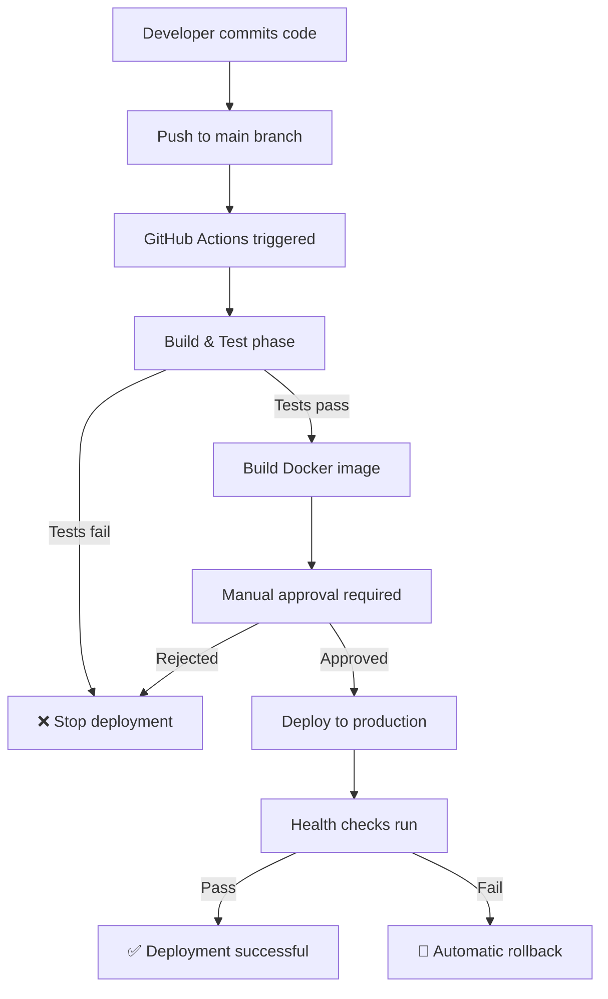

# CI/CD Deployment Guide - Antystyki

This guide covers the complete automated deployment process for Antystyki using GitHub Actions with manual approval gates.

---

## 📋 Table of Contents

1. [Architecture Overview](#architecture-overview)
2. [Prerequisites](#prerequisites)
3. [Initial Setup](#initial-setup)
4. [GitHub Configuration](#github-configuration)
5. [Server Setup](#server-setup)
6. [First Deployment](#first-deployment)
7. [Deployment Workflow](#deployment-workflow)
8. [Rollback Procedures](#rollback-procedures)
9. [Monitoring & Maintenance](#monitoring--maintenance)
10. [Troubleshooting](#troubleshooting)

---

## 🏗️ Architecture Overview

### Deployment Architecture

```
┌─────────────────────────────────────────────────────────────┐
│                       GitHub Repository                      │
│  ┌────────────┐  ┌────────────┐  ┌──────────────────────┐  │
│  │   Code     │  │  Configs   │  │  GitHub Actions      │  │
│  │  (main)    │  │   (.env)   │  │  (deploy.yml)        │  │
│  └────────────┘  └────────────┘  └──────────────────────┘  │
└────────────┬────────────────────────────────────────────────┘
             │
             ▼ Push to main
┌─────────────────────────────────────────────────────────────┐
│                     GitHub Actions Runner                    │
│  ┌────────┐  ┌────────┐  ┌──────────┐  ┌───────────────┐  │
│  │ Build  │─▶│  Test  │─▶│ Approval │─▶│ Build Docker  │  │
│  └────────┘  └────────┘  └──────────┘  └───────────────┘  │
└────────────┬────────────────────────────────────────────────┘
             │
             ▼ SSH + SCP
┌─────────────────────────────────────────────────────────────┐
│                 Kamatera Production Server                   │
│                                                              │
│  ┌────────────────────────────────────────────────────┐    │
│  │                    Nginx (Port 80/443)              │    │
│  │              (Reverse Proxy + SSL)                  │    │
│  └────────────┬───────────────────────────────────────┘    │
│               │                                              │
│               ▼                                              │
│  ┌────────────────────────────────────────────────────┐    │
│  │         Unified Docker Container (Port 5000)        │    │
│  │                                                     │    │
│  │  ┌──────────────────────────────────────────────┐ │    │
│  │  │         ASP.NET Core Backend                 │ │    │
│  │  │  • API Endpoints (/api/*)                    │ │    │
│  │  │  • Health Checks (/health)                   │ │    │
│  │  │  • Static File Serving                       │ │    │
│  │  └──────────────────────────────────────────────┘ │    │
│  │  ┌──────────────────────────────────────────────┐ │    │
│  │  │         React Frontend (in wwwroot)          │ │    │
│  │  │  • SPA Routing                               │ │    │
│  │  │  • Static Assets                             │ │    │
│  │  └──────────────────────────────────────────────┘ │    │
│  └────────────┬───────────────────────────────────────┘    │
│               │                                              │
│               ▼                                              │
│  ┌────────────────────────────────────────────────────┐    │
│  │         PostgreSQL Container (Port 5432)            │    │
│  │  • Database: antystics                              │    │
│  │  • Auto-initialization on first run                │    │
│  │  • Volume-backed persistence                       │    │
│  └────────────────────────────────────────────────────┘    │
└─────────────────────────────────────────────────────────────┘
```

### Deployment Flow

```
┌──────────────────────────────────────────────────────────────────┐
│                         Deployment Pipeline                      │
└──────────────────────────────────────────────────────────────────┘

1. [Developer Push] ──────────▶ Push to main branch
                                       │
                                       ▼
2. [GitHub Actions] ──────────▶ Build & Test
      • Restore dependencies
      • Build backend (.NET 9)
      • Build frontend (React + Vite)
      • Run tests
                                       │
                                       ▼
3. [Build Docker] ────────────▶ Multi-stage Docker build
      • Stage 1: Build frontend
      • Stage 2: Build backend
      • Stage 3: Combine into runtime image
                                       │
                                       ▼
4. [Manual Approval] ─────────▶ 🔐 GATE: Require human approval
      • Designated reviewers notified
      • Must approve before deployment
                                       │
                                       ▼
5. [Deploy] ──────────────────▶ Transfer to server & deploy
      • SSH into production server
      • Tag previous version (for rollback)
      • Load new Docker image
      • Stop old containers gracefully
      • Start new containers
                                       │
                                       ▼
6. [Health Check] ────────────▶ Automated verification
      • API health endpoint (200 OK)
      • Frontend accessibility
      • Database connectivity
      • Response time validation
                                       │
                                       ├─▶ [Success] ──▶ Deployment Complete ✅
                                       │
                                       └─▶ [Failure] ──▶ Automatic Rollback 🔄
                                                         • Restore previous image
                                                         • Restart containers
                                                         • Notify team
```

---

## 📦 Prerequisites

### Required Accounts & Services

- [ ] GitHub account with repository access
- [ ] Kamatera account (or equivalent VPS provider)
- [ ] Domain name (e.g., `antystyki.pl`)
- [ ] DNS configured to point to server IP
- [ ] Email service (Gmail App Password or SendGrid)

### Required Software (Local Machine)

```bash
# Git
git --version

# SSH client
ssh -V

# Docker (for local testing)
docker --version
```

---

## 🔧 Initial Setup

### Step 1: Clone Repository

```bash
git clone https://github.com/YOUR_USERNAME/antystyki.git
cd antystyki
```

### Step 2: Provision Server

**Recommended Specs:**
- **OS:** Ubuntu 22.04 LTS
- **RAM:** 2GB minimum (4GB recommended)
- **Storage:** 20GB minimum
- **Location:** Closest to target users

**Kamatera Setup:**
1. Log in to Kamatera dashboard
2. Create new server with specs above
3. Note the IP address
4. Save SSH credentials

### Step 3: Configure DNS

Add these DNS records:

| Type | Name | Value | TTL |
|------|------|-------|-----|
| A | @ | YOUR_SERVER_IP | 3600 |
| A | www | YOUR_SERVER_IP | 3600 |
| CNAME | api | antystyki.pl | 3600 |

Wait 15-30 minutes for DNS propagation.

---

## 🔐 GitHub Configuration

### Step 1: Set Up GitHub Secrets

Go to: **Repository → Settings → Secrets and variables → Actions → New repository secret**

Add these secrets:

```bash
# SSH Access
SSH_PRIVATE_KEY=<Your SSH private key>
SSH_USER=antystyki
PROD_SERVER_IP=<Your Kamatera server IP>
PROD_DOMAIN=antystyki.pl

# Docker Hub (Optional - for image registry)
DOCKER_USERNAME=<Your Docker Hub username>
DOCKER_PASSWORD=<Your Docker Hub password or token>
```

#### Generating SSH Key

```bash
# On your local machine
ssh-keygen -t ed25519 -C "github-actions-deploy" -f ~/.ssh/antystyki_deploy

# Copy private key (this goes to GitHub Secret)
cat ~/.ssh/antystyki_deploy

# Copy public key (this goes to server)
cat ~/.ssh/antystyki_deploy.pub
```

### Step 2: Configure Environment Protection

1. Go to **Settings → Environments**
2. Click **New environment**
3. Name it: `production`
4. Add **Required reviewers** (your GitHub username)
5. Save

This ensures manual approval before every deployment.

### Step 3: Enable GitHub Actions

1. Go to **Actions** tab
2. Enable workflows if prompted
3. The `deploy.yml` workflow should appear

---

## 🖥️ Server Setup

### Step 1: Initial Server Configuration

SSH into your server:

```bash
ssh root@YOUR_SERVER_IP
```

Run initial setup:

```bash
# Update system
apt update && apt upgrade -y

# Create deployment user
adduser antystyki
usermod -aG sudo antystyki

# Setup SSH for deployment user
mkdir -p /home/antystyki/.ssh
echo "YOUR_PUBLIC_KEY" >> /home/antystyki/.ssh/authorized_keys
chown -R antystyki:antystyki /home/antystyki/.ssh
chmod 700 /home/antystyki/.ssh
chmod 600 /home/antystyki/.ssh/authorized_keys

# Switch to deployment user
su - antystyki
```

### Step 2: Install Docker & Docker Compose

```bash
# Install Docker
curl -fsSL https://get.docker.com -o get-docker.sh
sudo sh get-docker.sh
sudo usermod -aG docker $USER

# Install Docker Compose
sudo curl -L "https://github.com/docker/compose/releases/latest/download/docker-compose-$(uname -s)-$(uname -m)" -o /usr/local/bin/docker-compose
sudo chmod +x /usr/local/bin/docker-compose

# Verify installations
docker --version
docker-compose --version

# Log out and back in for group changes
exit
# SSH back in as antystyki
```

### Step 3: Create Application Directory

```bash
sudo mkdir -p /var/www/antystyki
sudo chown -R antystyki:antystyki /var/www/antystyki
cd /var/www/antystyki
```

### Step 4: Create Environment File

Create `/var/www/antystyki/.env`:

```bash
cat > /var/www/antystyki/.env << 'EOF'
# PostgreSQL Configuration
POSTGRES_DB=antystics
POSTGRES_USER=postgres
POSTGRES_PASSWORD=REPLACE_WITH_STRONG_PASSWORD_32_CHARS

# ASP.NET Environment
ASPNETCORE_ENVIRONMENT=Production

# JWT Configuration
JWT_SECRET=REPLACE_WITH_RANDOM_64_CHARACTER_STRING
JWT_ISSUER=Antystics
JWT_AUDIENCE=AntysticsUsers

# Email Configuration (Gmail example)
SMTP_HOST=smtp.gmail.com
SMTP_PORT=587
SMTP_USER=your-email@gmail.com
SMTP_PASSWORD=your-gmail-app-password-16-chars
EMAIL_FROM_ADDRESS=noreply@antystyki.pl
EMAIL_FROM_NAME=Antystyki

# CORS Configuration
CORS_ALLOWED_ORIGINS=https://antystyki.pl,https://www.antystyki.pl

# AdSense (optional)
VITE_ADSENSE_PUBLISHER_ID=
VITE_ADSENSE_HEADER_SLOT=
VITE_ADSENSE_IN_FEED_SLOT=
VITE_ADSENSE_SIDEBAR_SLOT=
EOF
```

**Generate secure secrets:**

```bash
# Generate database password (32 chars)
openssl rand -base64 24

# Generate JWT secret (64 chars)
openssl rand -base64 48
```

**Edit the file and replace placeholders:**

```bash
nano /var/www/antystyki/.env
```

### Step 5: Install Nginx

```bash
sudo apt install nginx -y

# Copy nginx configuration
sudo cp /var/www/antystyki/nginx.production.conf /etc/nginx/sites-available/antystyki
sudo ln -s /etc/nginx/sites-available/antystyki /etc/nginx/sites-enabled/
sudo rm /etc/nginx/sites-enabled/default

# Test configuration
sudo nginx -t

# Restart Nginx
sudo systemctl restart nginx
sudo systemctl enable nginx
```

### Step 6: Install SSL Certificate

```bash
# Install Certbot
sudo apt install certbot python3-certbot-nginx -y

# Obtain certificate
sudo certbot --nginx -d antystyki.pl -d www.antystyki.pl

# Test renewal
sudo certbot renew --dry-run
```

### Step 7: Configure Firewall

```bash
sudo ufw allow OpenSSH
sudo ufw allow 'Nginx Full'
sudo ufw enable
sudo ufw status
```

---

## 🚀 First Deployment

### Option A: Deploy via GitHub Actions (Recommended)

1. **Push to main branch:**

   ```bash
   git add .
   git commit -m "Initial deployment setup"
   git push origin main
   ```

2. **Watch GitHub Actions:**
   - Go to **Actions** tab in GitHub
   - Watch the pipeline run through build, test, and Docker build

3. **Approve deployment:**
   - You'll receive a notification for approval
   - Review the changes
   - Click **Review pending deployments**
   - Check `production` and click **Approve and deploy**

4. **Monitor deployment:**
   - Watch as containers are deployed
   - Health checks will run automatically
   - If successful, you'll see ✅ in the workflow

5. **Verify:**
   - Visit https://antystyki.pl
   - Check https://antystyki.pl/api/health

### Option B: Manual First Deployment

If you need to deploy manually first:

```bash
# On server
cd /var/www/antystyki

# Clone repository (first time only)
git clone https://github.com/YOUR_USERNAME/antystyki.git .

# Build and start
docker-compose -f docker-compose.production.yml build
docker-compose -f docker-compose.production.yml up -d

# Check logs
docker-compose -f docker-compose.production.yml logs -f

# Run migrations
docker exec -it antystics-app dotnet ef database update

# Verify
curl http://localhost:5000/health
```

---

## 📊 Deployment Workflow

### Normal Deployment Process



### What Happens During Deployment

1. **Pre-deployment:**
   - Current container is tagged as `:previous`
   - Current version ID is saved to `.current_version`

2. **Deployment:**
   - Old containers stopped gracefully
   - New Docker image loaded
   - Containers started with new image
   - 15-second warmup period

3. **Health checks:**
   - `/api/health` must return 200 OK
   - Frontend must be accessible
   - Database connectivity verified

4. **Success:**
   - Deployment marked as successful
   - Summary posted to GitHub
   - Team notified

5. **Failure:**
   - Automatic rollback triggered
   - Previous version restored
   - Team notified
   - Manual intervention required

---

## 🔄 Rollback Procedures

### Automatic Rollback

The pipeline automatically rolls back if health checks fail:

1. Previous Docker image (tagged `:previous`) is restored
2. Containers are restarted
3. Health checks run again
4. If still failing, manual intervention needed

### Manual Rollback

If you need to roll back manually:

```bash
# SSH into server
ssh antystyki@YOUR_SERVER_IP
cd /var/www/antystyki

# Check previous version
cat .current_version

# Restore previous image
docker tag antystyki/app:previous antystyki/app:latest

# Restart containers
docker-compose -f docker-compose.production.yml down
docker-compose -f docker-compose.production.yml up -d

# Verify
curl http://localhost:5000/health
```

### Rollback to Specific Version

```bash
# List available images
docker images antystyki/app

# Tag specific version as latest
docker tag antystyki/app:COMMIT_SHA antystyki/app:latest

# Restart
docker-compose -f docker-compose.production.yml down
docker-compose -f docker-compose.production.yml up -d
```

---

## 📈 Monitoring & Maintenance

### Check Deployment Status

```bash
# View running containers
docker ps

# View logs
docker-compose -f docker-compose.production.yml logs -f

# View specific service
docker-compose logs -f app
docker-compose logs -f postgres

# Check resource usage
docker stats
```

### Run Health Checks

```bash
# Automated health check
./health-check.sh antystyki.pl

# Manual checks
curl -f https://antystyki.pl/api/health
curl -f https://antystyki.pl/api/categories
```

### Database Backups

Automated backups are configured in the deployment. To manually backup:

```bash
# Backup database
docker exec antystics-db pg_dump -U postgres antystics | gzip > backup_$(date +%Y%m%d).sql.gz

# Restore backup
gunzip < backup_20251016.sql.gz | docker exec -i antystics-db psql -U postgres antystics
```

### Update Application

To deploy updates:

1. Make code changes locally
2. Commit and push to main
3. Approve deployment in GitHub Actions
4. Monitor health checks

---

## 🐛 Troubleshooting

### Deployment Fails at Build Stage

**Problem:** Build errors in GitHub Actions

**Solution:**
```bash
# Test build locally
docker build -f Dockerfile.production -t antystyki/app:test .

# Check logs for errors
docker run --rm antystyki/app:test
```

### Deployment Fails at Health Check

**Problem:** Health checks return 503 or timeout

**Solution:**
```bash
# SSH into server
ssh antystyki@YOUR_SERVER_IP

# Check logs
docker-compose logs -f app

# Common issues:
# 1. Database not ready
docker-compose logs postgres

# 2. Environment variables missing
docker exec antystics-app env | grep JWT_SECRET

# 3. Migrations not applied
docker exec antystics-app dotnet ef database update
```

### Containers Won't Start

**Problem:** `docker-compose up` fails

**Solution:**
```bash
# Check for port conflicts
sudo netstat -tulpn | grep :5000

# Check disk space
df -h

# Check Docker logs
sudo journalctl -u docker

# Rebuild from scratch
docker-compose down -v
docker-compose build --no-cache
docker-compose up -d
```

### SSL Certificate Issues

**Problem:** HTTPS not working

**Solution:**
```bash
# Check certificate status
sudo certbot certificates

# Renew certificate
sudo certbot renew

# Test Nginx config
sudo nginx -t

# Check Nginx logs
sudo tail -f /var/log/nginx/error.log
```

### Database Connection Errors

**Problem:** "Cannot connect to database"

**Solution:**
```bash
# Check if PostgreSQL is running
docker ps | grep postgres

# Check database logs
docker logs antystics-db

# Test connection
docker exec -it antystics-db psql -U postgres -d antystics

# Verify connection string
docker exec antystics-app env | grep ConnectionStrings
```

---

## 📚 Additional Resources

- **HEALTHCHECK.md** - Detailed health check procedures
- **DEPLOYMENT.md** - Alternative deployment methods
- **PRODUCTION_SETUP.md** - Production environment setup
- **ANTYSTYKI_LAUNCH_GUIDE.md** - Complete go-live checklist
- **GitHub Actions Docs** - https://docs.github.com/actions

---

## ✅ Deployment Checklist

Before going live:

- [ ] GitHub Actions workflow is configured
- [ ] GitHub Secrets are set
- [ ] Production environment requires approval
- [ ] Server is provisioned and configured
- [ ] Docker and Docker Compose are installed
- [ ] `.env` file is created with secure values
- [ ] Nginx is configured with SSL
- [ ] DNS points to server
- [ ] Firewall is configured
- [ ] First deployment successful
- [ ] Health checks passing
- [ ] Monitoring is set up (UptimeRobot)
- [ ] Backups are automated
- [ ] Rollback procedure tested
- [ ] Team knows how to approve deployments

---

**Last Updated:** 2025-10-16  
**Version:** 1.0  
**Maintainer:** DevOps Team

